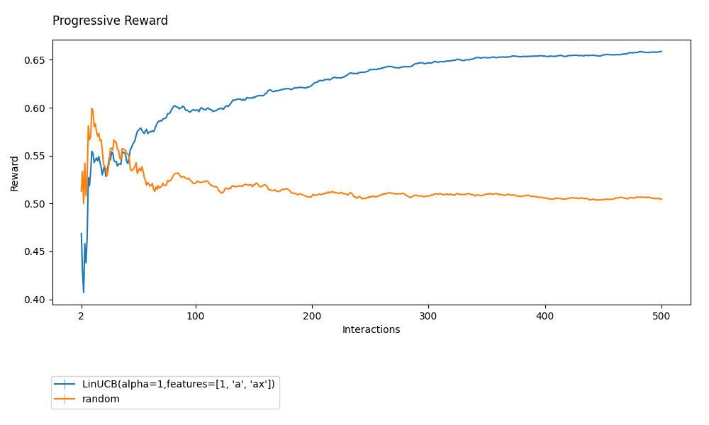

=================
Getting Started
=================

``Coba`` is an online contextual bandit (CB) research package (for both algorithmic and applied research).

Installation
~~~~~~~~~~~~

If you're brand-new to ``Coba`` the first step is to install it. This can be done easily via pip.

.. code-block:: bash

   $ pip install coba

Also, for the walkthrough below, you will need matplotlib as well (a Python plotting package).

.. code-block:: bash

   $ pip install matplotlib

   
First Experiment
~~~~~~~~~~~~~~~~

Once ``Coba`` is installed we are ready to conduct our first experiment. 

To begin save the following Python code below to a text file called ``first.py``.

.. code-block:: python

    from coba.environments import Environments
    from coba.learners     import RandomLearner, LinUCBLearner
    from coba.experiments  import Experiment

    env = Environments.from_linear_synthetic(500).shuffle([1,2,3]).binary()
    lrn = [ RandomLearner(), LinUCBLearner() ]

    result = Experiment(env, lrn).evaluate()
    result.plot_learners(xlim=(0,500), err='se')

Once the file has been saved run the file using python.

.. code-block:: bash

   $ python first.py

When the code finishes running this exact plot should appear:

And that's it. Just like that we've run an experiment comparing the performance
of LinUCB to randomly selecting actions. Not only that but we also created three
shuffles of our data in order to plot the standard error of the mean for average learner
performance. This is just the tip of the iceberg for what is possible. Before going 
further though we want to briefly stop to review the four core concepts in the code above.

Core Concepts
~~~~~~~~~~~~~

The experiment above introduced us to ``Coba``'s four core concepts.

.. note::
    All of ``Coba`` is organizaed around four core concepts. The four core concepts are
    
    1. Environments -- models of CB problems 
    2. Learners -- solvers of CB problems
    3. Experiments -- evaluations of learners on environments
    4. Results -- data generated by experiments
    
    Knowing this makes it much easier to find resources and perform advanced experiments.

Knowing the core concepts helps in finding more information about ``Coba``. For example, all the built-in  learners provided by coba can be 
found at :ref:`coba-learners`. Help with creating environments can be found at :ref:`coba-environments`. The various ways an experiment can 
be configured is described at :ref:`coba-experiments`. And details of analysis functionality can be found at :ref:`coba-experiment-results`.

Conclusion
~~~~~~~~~~

Everything above was meant to get you up and running with a first experiment and important concepts so you can find the resources going forward.
Unfortunately, doing real work with ``Coba`` probably still requires that you have a little more knowledge (though not too much). 

To get you there as quickly as possible we have two recommendations for next-steps (depending on what your research is). Once you've read through these we think 
you'll be making real meaningful progress with your research in no-time. Then you can use this documentation simply as a reference when issues come up.

 * For *all* researchers we suggest reading about the recommended workflow. :ref:`to-do`
 * For *algorithm* researchers we suggest reading about creating custom Learners. :ref:`to-do`
 * For *applied* researchers we suggest reading about creating custom Environments. :ref:`to-do`
