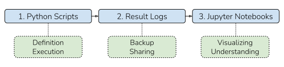

====================
Recommended Workflow
====================

Depending on one's needs and goals there are many ways to use ``Coba``. Here we describe a simple 
workflow that we've found, through experience, works for projects of most sizes. Whether or not this
workflow works for you this document should give you some good ideas for how to best use ``Coba``.

High-Level Organization
~~~~~~~~~~~~~~~~~~~~~~~

At a high-level we suggest organizing ``Coba`` research around three separate pieces: (1) The Python scripts
to run the experiments, (2) The result logs produced by the experiments, and (3) Jupyter notebooks to analyze
the result logs. Below is an example which compress all three of these pieces into a single Python script.

Example Code Comparison 
~~~~~~~~~~~~~~~~~~~~~~~~

.. code-block:: python
    
    #Naive Workflow

    #(1) Python script to create the experiment
    ###########################################
    from coba.environments import Environments
    from coba.learners     import RandomLearner, LinUCBLearner
    from coba.experiments  import Experiment

    env = Environments.from_linear_synthetic()
    lrn = [ RandomLearner(), LinUCBLearner() ]
    exp = Experiment(env, lrn)
    
    #(2) Store the experiment's result log in memory
    ##################################################
    result = exp.evaluate()
    
    #(3) Visualize the result of the experiment
    ##################################################
    result.plot_learners(xlim=(0,500), err='se')

While the compactness of the above script is nice we lose a lot of power by using only one tool (Python) for the job.
Now compare the example above with the same project broken into the three separate components in our recommmended workflow.
All changes have been highlighted.

.. code-block:: python
    :emphasize-lines: 13,14,15,17,18,19,20,21

    #Recommended Workflow

    #(1) Python script to create the experiment (unchanged)
    ###########################################
    from coba.environments import Environments
    from coba.learners     import RandomLearner, LinUCBLearner
    from coba.experiments  import Experiment

    env = Environments.from_linear_synthetic()
    lrn = [ RandomLearner(), LinUCBLearner() ]
    exp = Experiment(env, lrn)

    #(2) Write the experiment's result log to file (changed)
    ##################################################    
    exp.evaluate("result.log")
    
    #(3) In a Jupyter notebook cell somewhere (changed)
    ##################################################
    from coba.experiments import Result
    result = Result.from_file("result.log)
    result.plot_learners(xlim=(0,500), err='se')

Benefits of Recommendation 
~~~~~~~~~~~~~~~~~~~~~~~~~~

As we saw above, the recommended workflow only requires very few changes. But how mich does it actually
benefit us. There are five primary benefits to the recommended method over the naive method:

1. The experiment script can be executed anywhere (e.g., a powerful remote server)
2. The experiment script can always be resumed since results are written after every task.
3. The result logs make it possible to easily backup, archive, and share all experimental results.
4. Result analysis can start before experiments finish so long as the experiment is writing to disk. 
5. Results logs can be re-explored or tested for new hypothesis long after the original experiments.