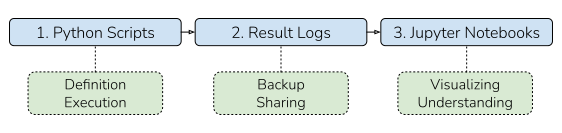

====================
Suggested Workflow
====================

Depending on one's needs and goals there are many ways to use ``Coba``. Here we describe a simple 
workflow that we've found, through experience, works for projects of most sizes. Whether or not this
workflow works for you this document should give you some good ideas for how to best use ``Coba``.

High-Level Organization
~~~~~~~~~~~~~~~~~~~~~~~

At a high-level we suggest organizing ``Coba`` research around three separate pieces: (1) The Python scripts
to run the experiments, (2) The result logs produced by the experiments, and (3) Jupyter notebooks to analyze
the result logs. Below is an example which compress all three of these pieces into a single Python script.

Example Code Changes 
~~~~~~~~~~~~~~~~~~~~~

.. code-block:: python
    
    #Naive Workflow

    #(1) Python script to create the experiment
    ###########################################
    from coba.environments import Environments
    from coba.learners     import RandomLearner, LinUCBLearner
    from coba.experiments  import Experiment

    env = Environments.from_linear_synthetic()
    lrn = [ RandomLearner(), LinUCBLearner() ]
    exp = Experiment(env, lrn)
    
    #(2) Store the experiment's result log in memory
    ##################################################
    result = exp.evaluate()
    
    #(3) Visualize the result of the experiment
    ##################################################
    result.plot_learners(xlim=(0,500), err='se')

While the simplicity of the above script is nice a lot is sacraficed for simplicity. By adding just a little complexity 
the naive workflow can be modified to the suggested workflow. These changes are shown below and all modified lines are
highlighted for easy comparison.

.. code-block:: python
    :emphasize-lines: 13,14,15,17,18,19,20,21

    #Suggested Workflow

    #(1) Python script to create the experiment (unchanged)
    ###########################################
    from coba.environments import Environments
    from coba.learners     import RandomLearner, LinUCBLearner
    from coba.experiments  import Experiment

    env = Environments.from_linear_synthetic()
    lrn = [ RandomLearner(), LinUCBLearner() ]
    exp = Experiment(env, lrn)

    #(2) Write the experiment's result log to file (changed)
    ##################################################    
    exp.evaluate("result.log")
    
    #(3) In a Jupyter notebook cell somewhere (changed)
    ##################################################
    from coba.experiments import Result
    result = Result.from_file("result.log)
    result.plot_learners(xlim=(0,500), err='se')

Benefits of Workflow
~~~~~~~~~~~~~~~~~~~~~

So why are we talking about this? Because we think the benefits are what make ``Coba`` special, and we want
to make sure every researcher out there using ``Coba`` is able to work as productively as possible. In 
particular we'd like to highlight five benefits of using the suggested workflow:

1. Experiments can be executed on remote servers so long as the result logs can be retreived.
2. Interrupted experiments can resume at the point of interruption since result logs save regularly.
3. Result logs can easily be backedup, archived, and shared with other researchers.
4. Long after an experiment is finished logs can be re-explored or tested for new hypothesis.
5. Analysis can start even before experiments finish since partial logs can be loaded in Jupyter. 

Of course, all of this is merely a suggestion. Feel free to take any ideas you like and throw out the rest.